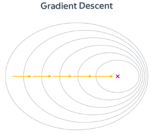
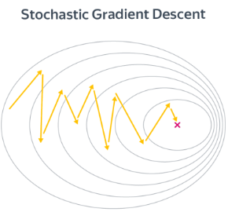

# Реализация градиентного спуска на Python без использования готовых библиотечных решений и с применением библиотечных функций.

1. Написание собственного RMSProp метода для оптимизации и реализация 3D и 2D визуализации.
2. Реализация градиентного спуска для невыпуклой функции и 3D-визуализация, вывод в консоль оптимальных значений для x1, x2, y.
3. Наглядное преставление приближения в процессе обучения гладкой функции на четырех различных графиках.
4. Создание модели градиентного спуска с помощью открытой библиотеки для машинного обучения TensorFlow(модель обучается некоторое время).
5. Расчет локального минимума для рандомно взятых чисел, расчет веса и смещения с помощью градиентого спуска, визуализация регрессионной прямой.
6. Реализация линейной регрессии с наглядным представлением как происходит приближение при увеличении количества эпох.

**Алгоритм градиентного спуска:**
```
w = random_normal()             # можно пробовать и другие виды инициализации
repeat S times:                 # другой вариант: while abs(err) > tolerance
   f = X.dot(w)                 # посчитать предсказание
   err = f - y                  # посчитать ошибку
   grad = 2 * X.T.dot(err) / N  # посчитать градиент
   w -= alpha * grad            # обновить веса
```


**Алгоритм стохастического градиентного спуска:**
```
 w = normal(0, 1)
 repeat E times:
   for i = B, i <= n, i += B
      X_batch = X[i-B : i]       
      y_batch = y[i-B : i]
      f = X_batch.dot(w)                 # посчитать предсказание
      err = f - y_batch                  # посчитать ошибку
      grad = 2 * X_batch.T.dot(err) / B  # посчитать градиент
      w -= alpha * grad
```
