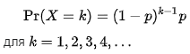
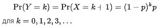
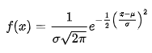
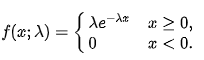

# Все мои проекты по обработке и визуализации данных

## Excel project 

> Проект выполнен в Microsoft Excel 2019 

### Dashboard + График-карта, выполнены по данным, конвертированным из csv-файла. 

Изначально датасет был взят с сайта [kaggle.com](https://www.kaggle.com/datasets/abhishekpatel/flavors-of-cacaocsv) и поделен на 2 папки (первая - 1000 строк, вторая - 797 строк).

> Полученный csv-файл так же прикреплен в файле. 

Из csv-файла были удалены все строки, содержащие пропуски в данных. И только после этого был создан Dashboard и График-карта:

перед их созданием были составлены промежуточные листы со сводными таблицами по данным, из которых уже берутся обобщенные, отфильтрованные данные на вывод в Dashboard и График-карту. 

> Грaфик-карта по сути является частью Dashbord.

*Dashbord визуализирует:*

- Средний процент содержания какао в плитке по странам, фильтруя данные по годам
- Средняя оценка шоколада по странам, фильтруя их по годам

*График-карта визуализирует:*

- REF стран по годам

## Python projects 

> Библиотеки pandas, numpy, matplotlib, seaborn, plotly, BeautifulSoup, request, functools, dash

**1. Красивая визуализация данных, взятых из [статьи о выбросах углекислого газа по странам](https://en.wikipedia.org/wiki/List_of_countries_by_carbon_dioxide_emissions) с Википедии.**

 > если программа на вашем компьютере не запускается, то скорее всего у вас не установлена библиотека plotly или bs4 или обе библиотеки сразу. 

    pip install plotly-express
    
    pip install bs4
    
> или у вас не установлен менеджер пакетов xlml, тогда:

```
pip install lxml
```
__1й файл:__

**Анимированная диаграмма.**

 Данные взяты с [guthubusercontent](https://raw.githubusercontent.com/CSSEGISandData/COVID-19/master/csse_covid_19_data/csse_covid_19_time_series/time_series_covid19_deaths_global.csv).

__2й файл:__

 Парсим страницу [Википедии](https://en.wikipedia.org/wiki/List_of_countries_by_carbon_dioxide_emissions) про выбросы углекислого газа в атмосферу. 

 Считываем необходимые нам строки из html-файла. Создаем датафрейм, в данном случае берем информацию только за 2018 год. Убираем в ручную 2 строки на которых невозожно конвертировать значения из столбца 'Total excluding LUCF'.

 Производим генерацию цветов для диаграмм и наслаждаемся нашей визуализацией.

**Диаграммы**:

 **1.** *выводятся прямо на компьютере*:
 - Круговая(#1: для неотсортированных по значению данных, #2: для отсортированных)
 
 **2.** *выводятся в окно браузера(созданы с помощью plotly.express)(интерактивные)*
 - Древовидная
 - Интерактивная гистограмма
 - Лепестковая(для отсортированных данных)
 - Пузырьковая(1: прямая, 2: круговая)
   > Для них сначала создаем надписи(метки) и параметры х и у для расположения "пузырьков на форме"
 
 **3.** *выводит несколько маленьких, а затем собарет их в одну*
 - Вафельная диаграмма
   > Сначала создаем идет метод для рисования отдельных графиков для каждой представленной в списке страны, а затем в методе get_collage мы собираем их в одну картинку Collage_waffel

**2. Dash projects.**

Проекты, реализованные с помощью библитеки Python dash.
Чтобы установить библиотеку, в командной строке вводим:

```
pip install dash
```

**3. MapReduce для данных по ароматам какао.**

 Использование стека MapReduce для быстрого подсчета количества повторений слов в столбце.

- чтение 6 столбца каждой строки из 2х csv-файлов
- общая сортировка данных
- вывод в консоль map-данных
- конвертация данных типа list в Dataframe (с помощью библиотеки pandas)
- визуализация

**4. Визуализация распределения вероятностей.**

> Реализуется с помощью библиотек matplotlib, numpy, scipy.


 - Визуализация распределения Бернулли(Bern_distribution): Bernuolli. 
    
    Случайная величина X имеет распределение Бернулли, если она принимает всего два значения: 1 и 0 с вероятностями p=1, q=1-p соответственно. Таким образом:
    **{P}(X=1)=p,**
    **{P}(X=0)=q.**
    Принято говорить, что событие {X=1} соответствует «успеху», а событие {X=0} — «неудаче». Эти названия условные, и в зависимости от конкретной задачи могут быть заменены на противоположные.

 - Биномиальное распределение(Binom_distribution).

    с параметрами n и p представляет собой дискретное распределение вероятностей числа успешных результатов в последовательности из n независимых экспериментов, в каждом из которых задается вопрос "да–нет", и каждый со своим собственным логическим значением результата: успех (с вероятностью p) или неудача (с вероятностью q=1-p). Единичный эксперимент с успехом / неудачей также называется испытанием Бернулли или экспериментом Бернулли, а последовательность результатов называется процессом Бернулли; для единичного испытания, т.е. n = 1, биномиальное распределение является распределением Бернулли. Биномиальное распределение является основой для популярного биномиального критерия статистической значимости.

    Биномиальное распределение часто используется для моделирования количества успешных результатов в выборке размером n, полученной с заменой из совокупности размером N. Если выборка выполняется без замены, розыгрыши не являются независимыми, и поэтому результирующее распределение является гипергеометрическим распределением, а не биномиальным. Однако для N, значительно больших, чем n, биномиальное распределение остается хорошим приближением и широко используется.

 - Геометрическое распределение(Geom_distribution).
   
    представляет собой одно из двух дискретных вероятностных распределений:
    
    Распределение вероятностей числа X испытаний Бернулли, необходимых для получения одного успеха, поддерживаемое на множестве {1,2,3,…}. Геометрическое распределение дает вероятность того, что первое достижение успеха потребует k независимых испытаний, каждое с вероятностью успеха p. Если вероятность успеха в каждом испытании равна p, то вероятность того, что k-е испытание будет первым успешным, равна

    
    
    Распределение вероятностей числа Y=X-1 неудач до первого успеха, поддерживаемое на множестве {0,1,2,...}. Приведенная выше форма геометрического распределения используется для моделирования количества попыток до первого успеха включительно. В отличие от этого, следующая форма геометрического распределения используется для моделирования количества неудач до первого успеха:

    

 - Распределение Пуассона(Pois_distribution).
    
    представляет собой дискретное распределение вероятностей, которое выражает вероятность того, что заданное количество событий произойдут за фиксированный интервал времени или пространства, если эти события происходят с известной постоянной средней частотой и независимо от времени, прошедшего с момента последнего события.

    Так же, как и биномиальное, распределение Пуассона – это распределение количества: количества раз того, как что-то произойдёт. Оно параметризуется не вероятностью p и количеством испытаний n, но средней интенсивностью λ, что, в аналогии с биномиальным, просто постоянное значение np. Распределение Пуассона – то, о чём надо вспоминать, когда идёт речь о подсчёте событий за определённое время при постоянной заданной интенсивности.

 - Отрицательное биномиальное распределение(Negativ_Binom_distribution).
 - Гипергеометрическое распределение(Hyper_Geom_distribution).

    представляет собой дискретное распределение вероятностей, которое описывает вероятность k успехов (случайных розыгрышей, при которых разыгранный объект имеет определенную особенность) при n розыгрышах, без замены, из конечной совокупности размеров, N которая содержит точно K объекты с этой особенностью, причем каждый розыгрыш является либо успешным, либо неудачным. В отличие от этого, биномиальное распределение описывает вероятность k успехов в n розыгрышах с заменой.

 - Дискретное равномерное распределение(Discret_Unif_distribution).
 - Равномерное распределение(Unif_distribution).
    
    Распределение случайной вещественной величины, принимающей значения, принадлежащие некоторому промежутку конечной длины, характеризующееся тем, что плотность вероятности на этом промежутке почти всюду постоянна.
    Говорят, что случайная величина имеет непрерывное равномерное распределение на отрезке [a, b], где a, b ∈ R.

 - Нормальное распределение(Normal_distribution).
    
    В статистике нормальное распределение или распределение Гаусса представляет собой тип непрерывного распределения вероятностей для вещественнозначной случайной величины. Общая форма его функции плотности вероятности такова

    

    *Стандартное нормальное распределение*

    Простейший случай нормального распределения известен как стандартное нормальное распределение или единичное нормальное распределение. Это частный случай, когда среднее равно нулю, а отклонение равно 1.
    
    Среди нормальных распределений можно выделить:

    -- Логнормальное распределение(Lod-normal) или еще его называют распределением Гальтона:

         непрерывное распределение вероятностей случайной величины, логарифм которой распределен нормально. Таким образом, если случайная величина X логарифмически нормально распределена, то Y = ln(X) имеет нормальное распределение. Эквивалентно, если Y имеет нормальное распределение, то экспоненциальная функция Y, X = exp(Y), имеет логарифмически нормальное распределение.

    -- t-Распределение Стьюдента:

         это основа t-теста, который многие нестатистики изучают в других областях. Оно используется для предположений о среднем нормального распределения и так же стремится к нормальному распределению с увеличением своего параметра. Отличительная особенность t-распределения – его хвосты, которые толще, чем у нормального распределения.

    -- Распределение Хи-квадрат:
    
         распределение сумм квадратов нормально-распределенных величин. На этом распределении построен тест хи-квадрат, который сам основан на сумме квадратов разниц, которые должны быть нормально распределены.

 - Экспоненциальное распределение(Expo_distribution).

   В теории вероятностей и статистике экспоненциальное распределение или отрицательное экспоненциальное распределение - это распределение вероятностей времени между событиями в процессе с точкой Пуассона, то есть процессе, в котором события происходят непрерывно и независимо с постоянной средней скоростью.

   Функция плотности вероятности экспоненциального распределения равна

   

   Здесь λ > 0 - параметр распределения, часто называемый параметром скорости. Распределение поддерживается на интервале [0, ∞). Если случайная величина X имеет такое распределение, мы записываем X ~ Exp(λ).

   Экспоненциальное распределение должно приходить на ум при размышлении о «времени до события», возможно, «времени до отказа». По факту, это такая важная ситуация, что существуют более обобщённые распределения чтобы описать наработку-на-отказ, типа распределения Вейбула. В то время, как экспоненциальное распределение подходит, когда интенсивность — износа, или отказов, например – постоянна, распределение Вейбула может моделировать увеличивающуюся (или уменьшающуюся) со временем интенсивность отказов. Экспоненциальное, в общем-то, частный случай.


